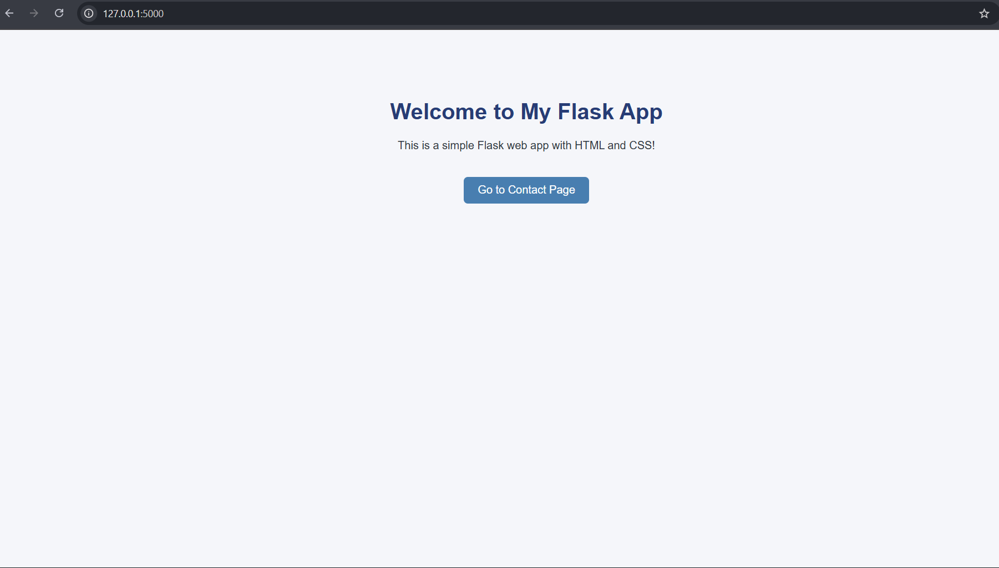
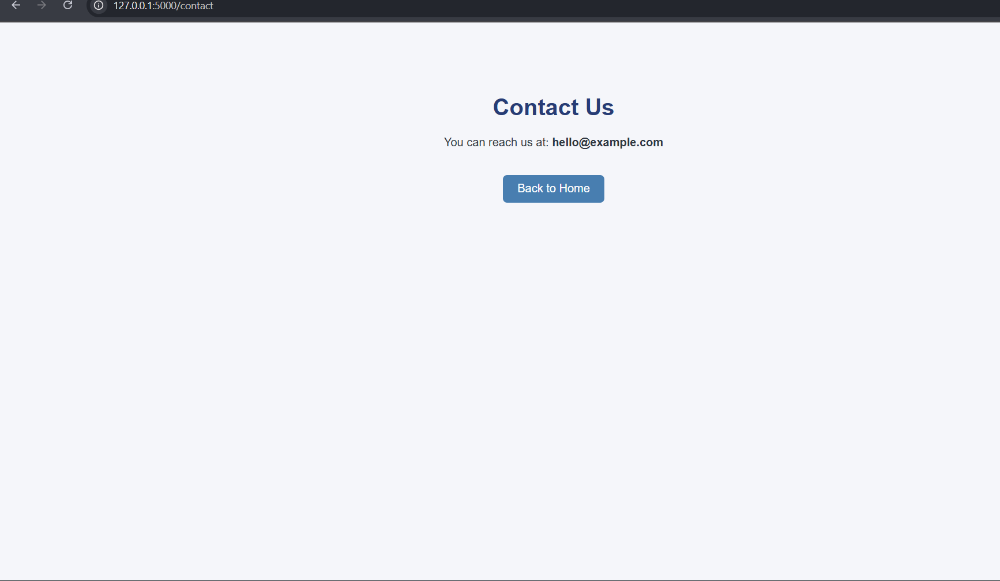

# 🐍 Flask Web App

A simple web application built using **Flask**, **HTML**, and **CSS**.  
It includes a **Home** and **Contact** page with basic routing and a clean layout.

---

## 📁 Project Structure
flask_app/
│
├── app.py # Main Flask application file
├── static/ # Static assets (CSS, JS, images)
│ └── style.css
└── templates/ # HTML templates
├── index.html
└── contact.html
🌐 Features

Flask-based backend

Clean and responsive front-end design

Simple navigation between pages

Organized and beginner-friendly structure
🧩 Tech Stack
Layer	Technology
Backend	Flask (Python)
Frontend	HTML5, CSS3
Server	Localhost / WSGI

## 📸 Screenshots

### 🏠 Home Page

### 📩 Contact Page

